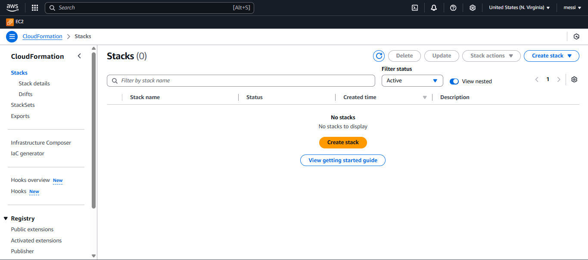
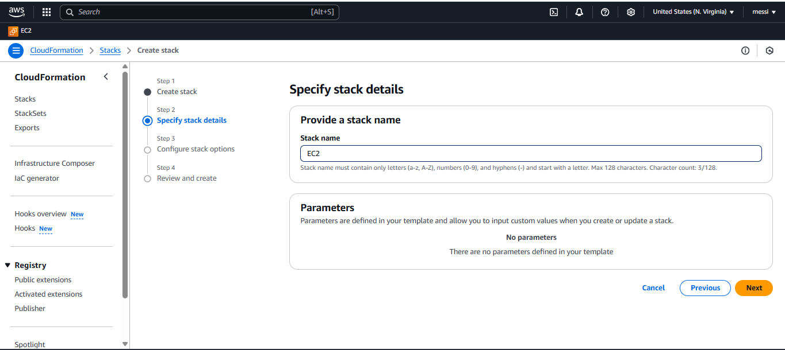

## What is AWS CloudFormation

AWS CloudFormation is an Infrastructure as Code(Iac) Service that allows you to define and Provision AWS infastructure using templates written in YAML or JSON. It helps automate the deployment and management of AWS resources in a repeatable and Scalable way.

## How is CloudFormation Different from other IaC Tools?

- **Native to AWS** - Deep integeration with AWS Services, unlike **Terraform**, which supports cloud providers.
- **State Management** - Unlike Terraform, which mantains a seperate state files, CloudFormation automatically tracks resources using AWS itself.
- **Free to use** - You only pay for the AWS resources provisioned; there is no seperate cost for using CLoudFormation.
- **Less Flexibility** - CloudFormation is AWS-specific, whereas tools like Terraform support hybrid cloud environments.

## Deploy your First EC2 Instance with CloudFormation

Follow these steps to set up an EC2 instance using AWS CloudFormation.

**Step 1:** Create a CloudFormation template.

Save the following YAML template as ec2-instance.yaml : 

```bash
AWSTemplateFormatVersion: '2010-09-09'
Description: 'CloudFormation Template to launch an EC2 instance'

Resources:
  MyEC2Instance:
    Type: AWS::EC2::Instance
    Properties:
      InstanceType: t2.micro
      ImageId: ami-0c55b159cbfafe1f0  # Replace with your region-specific AMI ID
      KeyName: my-key-pair  # Replace with your key pair name
      SecurityGroups:
        - default
      Tags:
        - Key: Name
          Value: MyFirstEC2

```
**Step 2:** Deploy the CloudFormation Stack

1) Go to AWS Console -> CloudFormation
2) Click Create stack -> With new resorces.



3) Upload the ec2-instance.yaml template.


You can View your Infra just click on View Infrastructure Composer.


4) Provide a stack name (eg, MyEC2Stack).



5) Click Next and review the settings.
6) Click Create Stack.

**Step 3:** Verify the EC2 instance.

- Go to the EC2 Dashboard in AWS.
- Check if an instance with the tag MyFirstEC2 is running.


## You can update your Stack 


## Deleting an AWS CloudFormation Stack

- Steps to Delete the CloudFormation Stack

    - **Go to the AWS Console** → Open **CloudFormation**.
    - **Find your stack** (e.g., `MyEC2Stack`).
    - Click on the **stack name** to open details.
    - Click **Delete** and confirm the action.

## What Happens?
- CloudFormation will **automatically** delete all resources it created, including the EC2 instance.
- If you created any resources manually (outside of CloudFormation), they **will not** be deleted.


## Troubleshooting

💡 **If deletion fails:**
- Check if the instance has a manually attached volume or security group.
- Ensure you didn’t modify CloudFormation-managed resources manually.

---

Following these steps ensures a clean deletion of your AWS CloudFormation stack without leaving behind unused resources.